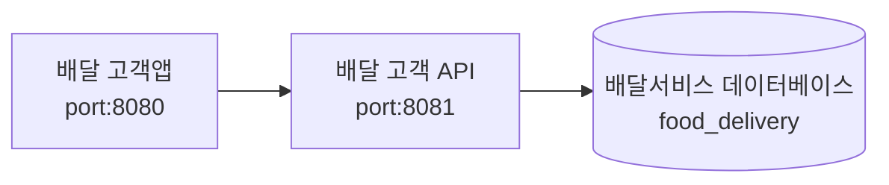

# 프로젝트
- 배달 서비스 프로젝트를 위한 **고객 앱 API**
- 서버 Port: 8081

# 준비사항
- (필수) 데이터베이스 설치
    - **food_delivery** 생성
    - 관련 테이블 생성
- (필수) 지도를 위한 Google Map Key
  - https://developers.google.com/maps?hl=ko

# 시스템 구성과 흐름

# 초기 접속 URL
- http://localhost:8081/hello?name=Sonic

# 초기 계정
- ID: test@test.com
- PW: 1111

# 고객 앱 화면

# Swagger UI
- http://localhost:8081/swagger-ui/swagger-ui.html